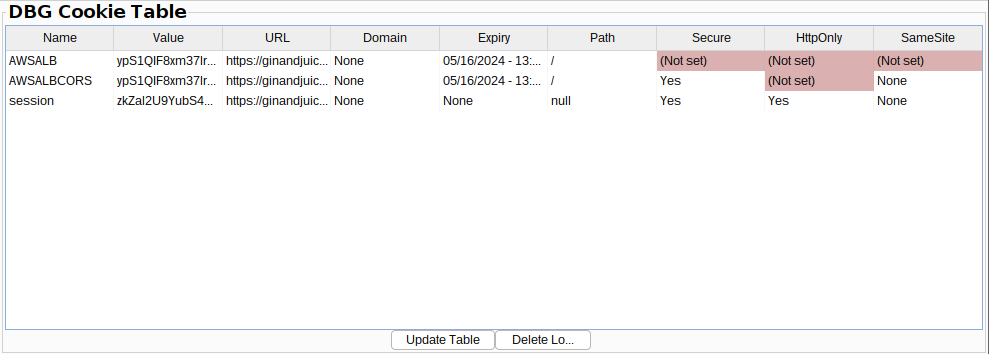

# Cookie Attribute Table

## Description
The Cookie Attribute Table is an extension for [Burp Suite](https://portswigger.net/burp), written in Java. It tracks all cookies set by in-scope targets and adds their names, values, and associated attributes to a table for easy reading and reporting of cookie-related security misconfigurations. Cookies with the same names but different attributes are reported in separate rows of the table so that inconsistently applied cookie attributes can be identified. 

## Installation

The extension can be pulled or downloaded from Github. 

Build it by running `gradle build` in the same directory as the build.gradle file. 

The built JAR file (<build.gradle directory>/build/libs/dbg-cookie-table.jar) can be imported into Burp via Burp's Extensions tab. Click the `Add` button next to the list of extensions and include the JAR file above. 

## Usage

The extension runs passively in Burp when it is loaded and enabled (check its checkbox in the Extensions tab). 
It opens a new tab in the Burp interface where you can view the cookie table. The table can be updated by clicking the "Update" button at the bottom of the table. Stored cookie information can be cleared by clicking "Clear Logs". Cookie data is persisted when a Burp project file is closed or crashes. 
